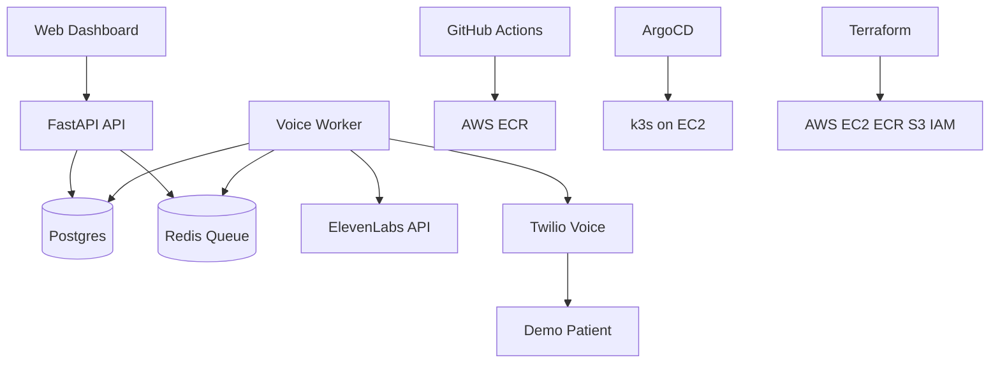

# Clara VoiceOps Architecture

Clara VoiceOps demonstrates how a small patient reminder feature can be operated like an enterprise platform.

## Data Model

- `patients`: demo patient identity, phone, preferred language, and consent flag.
- `providers`: doctors, pharmacists, and nurses.
- `provider_voices`: ElevenLabs voice IDs mapped to providers.
- `care_assignments`: patient-to-provider relationship records.
- `reminders`: reminder message and lifecycle status.
- `call_attempts`: generated audio path, Twilio call SID, errors, and status history.

## Operational Story

The API stays responsive by writing call work into Redis. The worker consumes those jobs independently, so it can be scaled with `kubectl scale deployment clara-worker --replicas=2 -n clara-voiceops` or later with KEDA based on queue depth.

ArgoCD owns the Kubernetes desired state from Git. GitHub Actions validates code, builds images, and pushes to ECR. Terraform provisions the AWS foundation for the single-node k3s demo.
